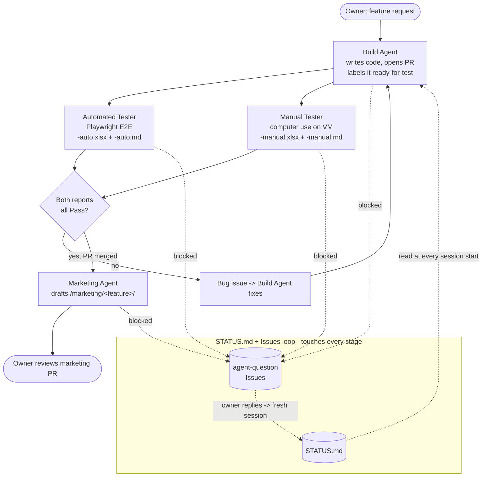

# Pipeline Architecture

A plain-language map of how this multi-agent pipeline works. For the repo
owner's future reference.

## The idea

One repo acts as the **shared memory** for four AI agent roles. The
agents are not separate programs — they're the same Claude Code / Cowork
engine, each session loaded with a different **Skill** depending on what
triggered it. All coordination happens through files in this repo plus
GitHub Issues and PRs.

## The four roles

1. **Build agent** — writes the application code. Runs in Claude Code
   (cloud).
2. **Automated tester** — writes and runs Playwright tests against web
   flows. Runs in Claude Code (cloud).
3. **Manual tester** — clicks through the app like a person, using
   computer use on a VM. Runs in Claude Cowork.
4. **Marketing agent** — drafts promo content once a feature is shipped
   and fully passes testing. Runs in Cowork or Claude Code.

## Never block on a human

The owner is often away. So no session ever waits. When an agent needs a
decision it can't make, it:

1. writes where it stopped into `STATUS.md`,
2. opens a GitHub Issue with its question (`agent-question` template),
3. ends the session.

The owner answers the issue whenever they can. A **Routine** sees the
reply and starts a **fresh** session that rebuilds context from
`CLAUDE.md` → `STATUS.md` → the issue thread, then continues. Nothing is
kept running. Full detail: [`resume-protocol.md`](resume-protocol.md).

## Flow

## Key files

| File | Purpose |
|------|---------|
| `CLAUDE.md` | First read for every session; the rules + role index |
| `STATUS.md` | Structured live state, one block per role |
| `.github/ISSUE_TEMPLATE/agent-question.md` | How agents ask the owner |
| `skills/*/SKILL.md` | Per-role instructions |
| `qa-runs/` | Test reports (`.xlsx` + `.md`), auto and manual |
| `marketing/` | Marketing drafts |
| `docs/resume-protocol.md` | The ask-and-pause / resume mechanic |
| `docs/routines-setup.md` | How to wire the triggers (done in the UI) |

## Report format (both testers)

Identical structure so the two runs compare row-for-row:
`.xlsx` with a **Results** sheet (Test Case, Steps, Expected, Actual,
Status, Screenshot Reference) and a **Summary** sheet (pass/fail/blocked
counts), plus a matching `.md` table as the diffable source of truth.
