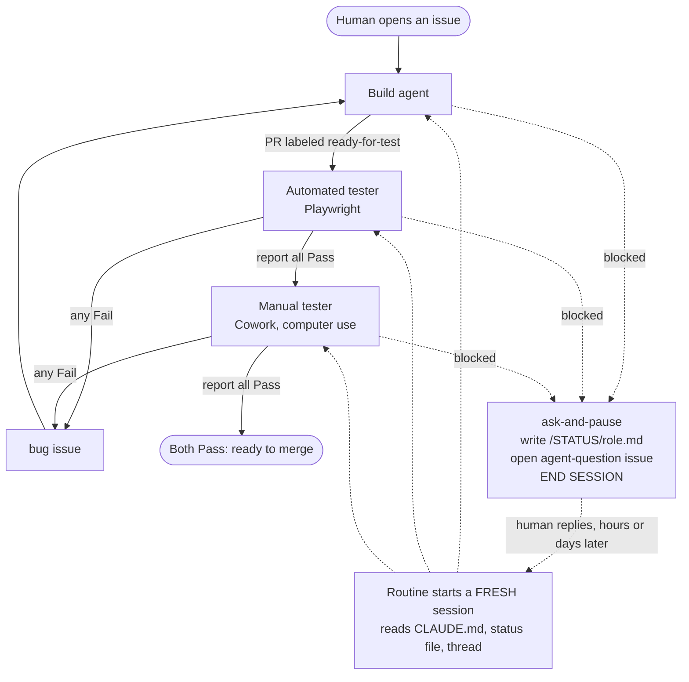

# Pipeline architecture

Written for a human deciding whether to adopt this, not for an agent at
session start.

## The shape of it

A human opens an issue. A build agent implements it and labels the PR. Two
testers — one programmatic, one clicking through a real desktop — check the
result independently and file reports in the same format. Both must pass.
Any agent that gets stuck writes down where it stopped, asks in an issue,
and dies; a later event brings up a fresh session that reads the repo and
carries on.

The dotted path touches every stage. It is not an error path — it is the
normal way a session ends when the answer is not in the repo.

## Three ideas hold it together

**The repo is the only memory.** Agents share no process and never message
each other. Everything one needs to know about another's work is a
committed file: `/STATUS/<role>.md` for state, `/qa-runs/` for results,
labels for signals. Sessions are disposable; the repo is not.

**No session ever waits.** A blocked agent records its state and stops,
rather than holding a session open for a human who may be asleep. This
costs a cold start on resume and buys immunity to timeouts, disconnects,
and days of delay. See `resume-protocol.md`.

**Two independent testers, both required.** The build agent wrote the code
and shaped the tests around it, so a passing automated suite can share the
author's blind spot. The manual tester looks at the actual screen. Neither
signs off alone.

## Why one status file per role

Roles write status at unpredictable times, sometimes concurrently. One
shared file would produce merge conflicts between agents — a class of
failure with no good automated recovery. Per-role files never contend: each
role writes only its own, and reads the others.

## Adding roles

The diagram grows by addition. A new role slots in beside the existing ones
without restructuring anything, because nothing here is coded against a
fixed set of roles — the `CLAUDE.md` table is the whole registry. See
`adding-a-new-role.md`.

## What this does not do

- **It does not merge for you.** "Both Pass" is a state, not an action.
- **It does not schedule work.** A human opens the first issue.
- **It cannot wire its own triggers.** Routines are UI config, outside the
  repo — see `routines-setup.md` for that limitation.
